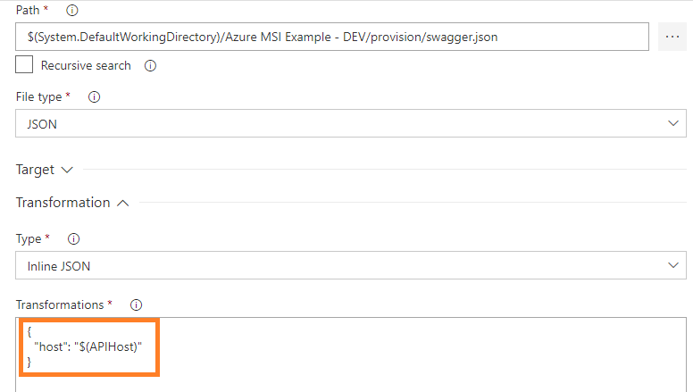
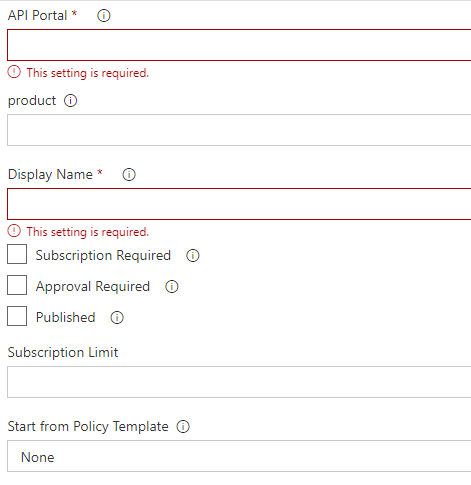
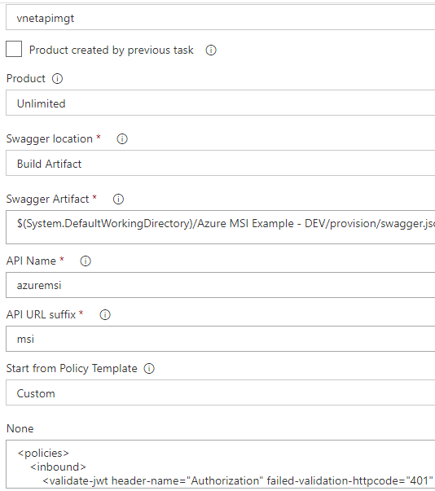
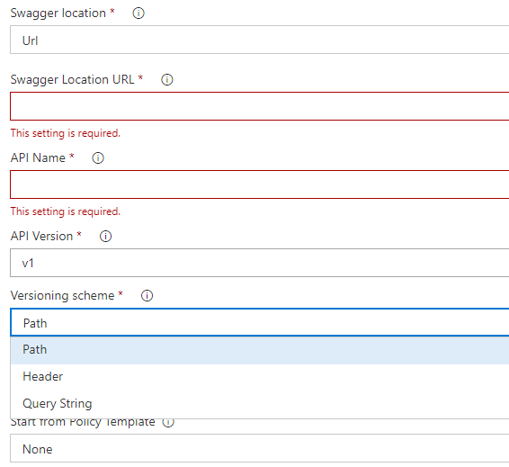
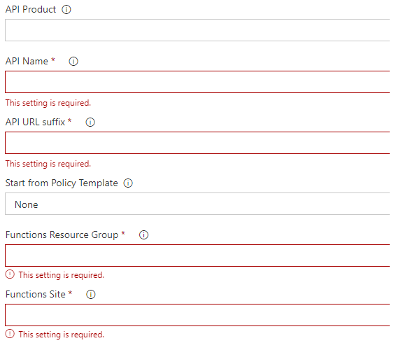
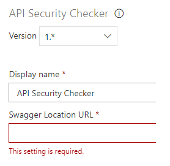

# azure-apim-extension
Full Azure API Management suite and more VSTS extension
# Disclaimer
This software is provided as-is with no warranty of any kind. 
# API Management Suite in a nutshell
The purpose of this extension is to bring Azure API Management into VSTS as part of your release lifecyle. Whether you use API Management to monetize APIS or for internal purposes, it
is good to associate the release of your backends APIs with their corresponding facade APIs published against the API Gateway. On top of the API Management integration, the extension also 
ships with an API Security Checker that helps validating that all endpoints of an API are well secured, this is of course only applicable to non-public APIs.
# Release Notes
## v3.5.2
* Added the possibility to use previously created / updated operations - Serge Aradj
## v3.5.1
* Addition of the subscription flag to non-versioned APIs - Sorin Pasa
* Possibility to support non-commercial endpoint - Joey Eng
## v3.5.0
* New task to manage API Revisions
## v3.4.6
* Making it possible to publish new revision as current revision
## v3.4.5
* Support of API revisions in operation-level policies
* Support of API revisions in API-level policies
* Support of API revisions for versioned APIs
## v3.4.1
* Fixed a bug when redeploying existing version
* Added the possibility to use dots in version numbers.
## v3.4.0
* Support of OpenAPI v3
* New task to create or update global policy. 
* ARM API version selector added to two of the tasks
## v3.3.0
* New task to set policies on API operations. Kudos: Luis Ruiz Pavon
* Ability to choose the Azure ARM API version to work with. Kudos:Jacques Snyman
## v3.2.0
* It is now possible to push and restore the configuration to the underlying Git repo. Kudos:Justin Marshall
## v3.1.0
* Security Groups get created on the fly when creating/updating products
* APIs can be linked to multiple products Kudos:Luis Ruiz Pavon
## v2.2.0
* Added the possibility to associate groups to products. Author: Luis Ruiz Pavon
## v2.1.0
* New task to import legacy services from WSDL: SOAP Pass-Through and SOAP to REST. Author: Luis Ruiz Pavon
## v2.0.1/5
* Minor improvements in the policy templates
* Product creation task revisited to with visibility rules
* Support of OAuth2 servers and OpenID Connect integration. Note that if you double check the authorization settings in the portal, you might need to refresh the page multiple times before it gets rendered correctly.
## v2.0 - new features
The below features were added.

* Versioning Scheme (Segment, Query String, HTTP Header)
* Inline Swagger and Swagger as a build artifact
* API Suffix
## v2.0 - bug fixes
* Switched the input type from "string" to "multiline" for policies
* Added a new policy of type "custom"
## V1.0.1/2
Update of the documentation.
## v1.0
* Supports versioned APIs
* Creation of API products on the fly
* Supports both API and Product policies
* Supports the creation of APIs on top of Azure Functions
* API Security checker

# Setup prerequisite and considerations
In order to use this extension, you must have an ARM Service Endpoint configured in VSTS and make sure this endpoint is allowed to contribute to API Management instances. This can easily 
be done by granting Subscription Contributor role or the ad-hoc API Management Service Contributor role. Similarly, the endpoint should  have access to the Azure Functions should you plan to use the tasks related to Azure Functions.

Depending on your usage of API Management, some extra considerations should also be paid attention to. If your backend APIs are part of a dedicated VNET, make sure the VSTS agents have connectivity to them. In case you provide a web URL for the Swagger definition, the extension makes use of Swagger import and downloads the Swagger definition of the backend API. Therefore, connectivity between the VSTS agent and the target API is required.
If you do not have such connectivity, you should fallback to in-line Swagger (provided as a piece of text) or a Swagger from file provided as a build artifact. For the latter, you might want to use a Config Transformation task as part of your release definition in order to inject the right API host as shown below:  

   where in this case, the APIHost variable is defined as a enviromnment-scoped release variable. 

# Generic remark
API description and display name come from the OpenAPI definition itself, that's the reason why these settings are not captured by the tasks.
# Policies
A few tasks allow to set policies at product and/or API level. They come with some pre-defined policies which you can override to adjust them to specific needs. You can easily use other policies by getting the default boilerplate config from the APIM Portal.
# Tasks included in the extension
## API Management - Create or update product
This task allows you to create a new product or update an existing one. The following screenshot illustrates the task:  

   Where parameters such as approval required and subscription limits may be defined as well as more advanced policies using one of the provided policies or a custom one.

## API Management - Create or update API
This task allows you to create a new Gateway API or update an existing one, against backend APIs.   

   where you reference the Swagger location as well as the API suffix and optionally a policy that governs the API such as a JWT validation policy.
  Note that you can create gateway APIs based on WSDL files.
## API Management - Create or update versioned API
This task allows you to create a new Versioned Gateway API or update an existing one, against backend APIs. The reason why versioning has been put in a separate task is to make it clear for the VSTS Release Managers and to be compliant with the old way of working with APIM which did not support versioning in the past. 

   where you may also define the versioning scheme.
## API Management - Create or update API against Azure Functions
This task allows you to create a new Gateway API or update an existing one, against Azure Functions that are protected with a code in the Function URL. For each and every function, a corresponding API Operation is created with a specific policy that injects the function's secret as a querystring parameter.  

  where the only thing you have to do is to map the new API you create with the target function site.
## API Management - Create or update versioned API against Azure Functions
Same as above but in a versioned way.
## API Security Checker 
This very basic task parses the Swagger definition of an API (or MVC apps) to check whether all the exposed endpoints are secured. Every return code that differs from 401 or 302 (redirection to the login page) are marked unsafe. If at least one unsafe endpoint is discovered, the task fails to complete and all the tested endpoints appear in the logs.  

   Since this task needs to call the target API, the only way to provide the swagger definition is via its URL. If the Swagger endpoint is protected via a key, just provide it as part of the URL.
